# Auto Lead Warmer - Architecture Documentation

## System Architecture Flowchart

```mermaid
flowchart TD
    %% Configuration & Entry Points
    Config[(Config.js)]
    CodeEntry([onOpen - Menu Entry])
    SetupEntry([setupHeadersAndFormat])
    RunEntry([runAutoLeadWarmer])
    SendNowEntry([sendNowFromMenu])
    CheckEntry([checkOpenAndReplies])

    %% Core Business Logic
    subgraph "Entry & Setup Layer"
        Code[Code.js]
        CodeEntry --> Code
        SetupEntry --> Code
        Code --> SheetSetup(setupHeaders)
        Code --> FormatLeads(formatAllLeadRows)
        Code --> AnalyticsDash(updateSummaryStatistics)
    end

    subgraph "Configuration Layer"
        Config
        Config -.->|Provides constants| AllServices[All Services]
    end

    subgraph "User Management"
        UserInfo[UserInfoService.js]
        UserInfo --> GetUserInfo(getUserInfo)
        UserInfo --> GenSemBrief(generateSeminarBrief)
        UserInfo --> CheckSemBrief(checkAndGenerateSeminarBrief)
        UserInfo --> UserSheet(getUserInfoSheet)
    end

    subgraph "Processing Workflow"
        Processing[ProcessingService.js]
        RunEntry --> Processing
        Processing --> HandleSeminar(handleSeminarBrief)
        Processing --> SetupTriggers(setupTriggers)
        Processing --> ProcessAll(processAllRows)
        ProcessAll --> BatchProcess(processBatchConcurrently)
        BatchProcess --> GenProfiles(generateLeadsProfilesConcurrently)
        BatchProcess --> GenAngles(generateMailAnglesConcurrently)
        BatchProcess --> GenMails(generateFirstMailsConcurrently)
        BatchProcess --> SetupSched(setupSchedules)
    end

    subgraph "Content Generation"
        Content[ContentGenerator.js]
        Content --> GenLeadProfile(generateLeadsProfile)
        Content --> GenMailAngles(generateMailAngles)
        Content --> ParseAngles(parseMailAngles)
        Content --> GenMailsBatch(generateMailsBatch)
        Content --> GenProfilesBatch(generateLeadsProfilesBatch)
        Content --> GenAnglesBatch(generateMailAnglesBatch)
    end

    subgraph "API Integration"
        API[APIService.js]
        API --> CallLLM(callLLMAPI)
        API --> CallBatch(callLLMAPIBatch)
        API --> CreateUser(createUser)
        API --> CheckPayment(checkUserPaymentStatus)
        Content ==> API
    end

    subgraph "Sheet Operations"
        Sheet[SheetService.js]
        Sheet --> GetSheet(getMainSheet)
        Sheet --> SetupHeaders(setupHeaders)
        Sheet --> GetUnprocessed(getUnprocessedData)
        Sheet --> UpdateStatus(updateStatus)
        Sheet --> UpdateInfo(updateInfo)
        Sheet --> FormatRows(formatAllLeadRows)
        Sheet --> SendNowBtn(setupSendNowButton)
        Sheet --> ValidateChar(validateCellCharacterLimit)
        Processing ==> Sheet
        Code ==> Sheet
    end

    subgraph "Email Management"
        Email[EmailService.js]
        Email --> ScheduleEmails(scheduleEmails)
        Email --> CheckSendMails(checkAndSendMails)
        Email --> SendEmail(sendEmail)
        Email --> SendImmediate(sendImmediateEmail)
        Email --> AddPixel(addPixelTracking)
        Email --> RecordSent(recordSentEmail)
        Email --> GenNext(generateNextMailIfNeeded)
        Email --> BatchGenNext(batchGenerateNextMails)
        Processing --> ScheduleEmails
    end

    subgraph "Send Now Feature"
        SendNow[SendNowHandler.js]
        SendNowEntry --> MenuService
        MenuService --> SendNow
        SendNow --> HandleClick(handleSendNowClick)
        SendNow --> FindNext(findNextEmailToSend)
        SendNow --> CheckSent(isEmailSent)
        HandleClick --> SendImmediate
    end

    subgraph "Menu & UI"
        MenuService[MenuService.js]
        MenuService --> SendNowMenu(sendNowFromMenu)
        MenuService --> TriggerStats(showTriggerStats)
        MenuService --> PixelStats(showPixelTrackingStats)
        MenuService --> CheckOpenReply(checkOpenAndReplies)
        MenuService --> DeleteTriggers(deleteAllTriggersMenu)
        CheckEntry --> MenuService
    end

    subgraph "Trigger Management"
        Triggers[TriggerManager.js]
        Triggers --> CreateGlobal(createGlobalEmailTrigger)
        Triggers --> CreateReply(createReplyDetectionTrigger)
        Triggers --> CreatePixel(createPixelTrackingTrigger)
        Triggers --> Cleanup(cleanupOldTriggers)
        Triggers --> DeleteAll(deleteAllLeadWarmerTriggers)
        Triggers --> GetStats(getTriggerStats)
        Processing --> SetupTriggers
        SetupTriggers --> Triggers
    end

    subgraph "Detection Services"
        Reply[ReplyDetectionService.js]
        Reply --> CheckReplies(checkForReplies)
        Reply --> CheckAll(checkAllRunningLeadsForReplies)
        Reply --> GetSent(getSentEmails)
        Reply --> CleanupData(cleanupLeadScheduleData)

        Pixel[PixelTrackingService.js]
        Pixel --> CheckOpens(checkPixelOpens)
        Pixel --> GetOpens(getPixelOpensFromFirebase)
        Pixel --> GetPixelStats(getPixelTrackingStats)

        Bounce[BounceDetectionService.js]
        Bounce --> CheckBounces(checkForBounces)
        Bounce --> IsBounce(isBounceMessage)
        Bounce --> CheckAllBounces(checkAllRunningLeadsForBounces)
        Bounce --> CalcBounceRate(calculateBounceRate)
    end

    subgraph "Analytics & Statistics"
        Analytics[AnalyticsService.js]
        Analytics --> UpdateSummary(updateSummaryStatistics)
        Analytics --> GetBounceStats(getBounceStatistics)
        Analytics --> GetOpenStats(getOpenStatistics)
        Analytics --> GetReplyStats(getReplyStatistics)

        Stats[StatisticsService.js]
        Stats --> StartRun(startRun)
        Stats --> RecordSeminar(recordSeminarBrief)
        Stats --> RecordRow(recordRowProcessing)
        Stats --> EndRun(endRun)
        Stats --> LogFinal(logFinalSummary)
    end

    subgraph "Event Handlers"
        EditHandler[EditHandler.js]
        EditHandler --> OnEdit(onEdit)
        EditHandler --> HandleStatus(handleStatusChange)
        EditHandler --> IsMainSheet(isMainSheet)
        Code -.->|Simple Trigger| OnEdit
    end

    subgraph "Utility Services"
        Utils[Utils.js]
        Utils --> GenSchedule(generateScheduleTimes)
        Utils --> FormatDate(formatDate)
        Utils --> ParseSchedule(parseScheduleTime)
        Utils --> ParseEmail(parseEmailContent)
        Utils --> ValidateEmail(isValidEmail)
        Utils --> ValidateLimit(validateCharacterLimit)

        Toast[ToastService.js]
        Toast --> ShowSuccess(showSuccess)
        Toast --> ShowInfo(showInfo)
        Toast --> ShowWarning(showWarning)
        Toast --> ShowCompletion(showCompletion)
        Toast --> ShowBatch(showBatchResult)
    end

    %% Key Relationships
    GenProfiles --> Content
    GenAngles --> Content
    GenMails --> Content

    CheckSendMails -->|Scheduled| SendEmail
    CheckSendMails --> GenNext

    CheckOpenReply --> CheckOpens
    CheckOpenReply --> CheckAll
    CheckOpenReply --> CheckAllBounces
    CheckOpenReply --> UpdateSummary

    OnEdit -->|Status Change| HandleStatus
    HandleStatus --> SendNowBtn

    SendEmail --> AddPixel
    SendEmail --> RecordSent

    Processing --> Stats

    %% Styling
    classDef entryPoint fill:#e1f5e1,stroke:#4caf50,stroke-width:3px
    classDef service fill:#e3f2fd,stroke:#2196f3,stroke-width:2px
    classDef config fill:#fff9c4,stroke:#fbc02d,stroke-width:2px
    classDef detection fill:#fce4ec,stroke:#e91e63,stroke-width:2px

    class CodeEntry,SetupEntry,RunEntry,SendNowEntry,CheckEntry entryPoint
    class Config config
    class Reply,Pixel,Bounce detection
```



## Architecture Overview

The Auto Lead Warmer Apps Script system follows a **layered service-oriented architecture** with clear separation of concerns.

### Layer Structure

#### 1. Entry Point Layer
- **Code.js** - Main entry point
  - Menu setup (`onOpen`)
  - Initial setup coordination
  - Event handler delegation

#### 2. Configuration Layer
- **Config.js** - Central configuration
  - Column definitions (`COLUMNS`)
  - User info field mappings (`USER_INFO_FIELDS`)
  - Email prompt templates (`EMAIL_PROMPT_TEMPLATE`)
  - Character limits and constants

#### 3. Business Logic Layer
- **ProcessingService.js** - Main workflow orchestrator
  - 4-stage batch processing pipeline
  - Concurrent content generation
  - Schedule and trigger setup
- **ContentGenerator.js** - AI content generation
  - Leads profile generation (Perplexity)
  - Mail angles generation (GPT)
  - Batch email generation
- **UserInfoService.js** - User data management
  - User info sheet operations
  - Seminar brief generation
  - Email signature creation

#### 4. Service Layer
- **APIService.js** - External API integration
  - Firebase Cloud Functions communication
  - Batch API calls
  - Payment verification
- **EmailService.js** - Email lifecycle management
  - Email sending and scheduling
  - Pixel tracking injection
  - Next email auto-generation
- **SheetService.js** - Google Sheets operations
  - Sheet data access
  - Status and info updates
  - Formatting and validation

#### 5. Feature Modules
- **Detection Services**
  - **ReplyDetectionService.js** - Gmail reply monitoring
  - **BounceDetectionService.js** - Email bounce detection
  - **PixelTrackingService.js** - Open tracking via pixels
- **Analytics Services**
  - **AnalyticsService.js** - Engagement metrics
  - **StatisticsService.js** - API usage tracking
- **Handler Services**
  - **EditHandler.js** - Sheet edit events
  - **SendNowHandler.js** - Immediate email sending
  - **MenuService.js** - Menu functionality
- **Trigger Management**
  - **TriggerManager.js** - Scheduled task coordination

#### 6. Utility Layer
- **Utils.js** - Common utilities
  - Schedule generation
  - Date/time formatting
  - Email parsing and validation
- **ToastService.js** - User notifications
  - Non-blocking toast messages
  - Success/error/info notifications

### Key Workflows

#### Lead Processing Workflow
```
runAutoLeadWarmer
  ↓
handleSeminarBrief (validate/generate seminar brief)
  ↓
setupTriggers (create scheduled tasks)
  ↓
processAllRows (batch processing)
  ↓
processBatchConcurrently
  ├→ Stage 1: generateLeadsProfilesConcurrently
  ├→ Stage 2: generateMailAnglesConcurrently
  ├→ Stage 3: generateFirstMailsConcurrently
  └→ Stage 4: setupSchedules + setupEmailTriggers
```

#### Email Sending Workflow
```
Hourly Trigger: checkAndSendMails
  ↓
Read schedule from sheet
  ↓
Check if send time reached
  ↓
sendEmail (with pixel tracking)
  ↓
recordSentEmail
  ↓
generateNextMailIfNeeded (auto-generate mail 2/3)
```

#### Detection Workflow
```
Scheduled Triggers (hourly/daily)
  ↓
checkPixelOpens / checkAllRunningLeadsForReplies / checkAllRunningLeadsForBounces
  ↓
Update sheet status (Reply/Bounce/Done)
  ↓
updateSummaryStatistics
```

### Design Patterns

1. **Service-Oriented Architecture**
   - Each file represents a distinct service
   - Clear single responsibility
   - Minimal coupling between services

2. **Batch Processing**
   - Parallel API calls using `UrlFetchApp.fetchAll()`
   - 10 rows per batch to optimize quota usage
   - Concurrent content generation phases

3. **Event-Driven Automation**
   - Time-based triggers for scheduled tasks
   - Simple triggers for user interactions
   - Lazy generation (mail 2/3 generated after mail 1 sent)

4. **Stateful Sheets as Database**
   - Google Sheets as persistent storage
   - Status tracking for workflow management
   - Schedule data stored directly in cells

5. **Decoupled Modules**
   - Clear interfaces between services
   - Configuration centralized in Config.js
   - Dependency injection via function parameters

### File Count & Statistics

- **Total Files**: 19 JavaScript files
- **Total Functions**: ~110+ functions
- **Lines of Code**: ~3,500+ LOC
- **Service Layers**: 6 distinct layers
- **Subgraph Groups**: 11 logical groupings

### Technology Stack

- **Platform**: Google Apps Script (JavaScript ES6)
- **AI Services**: OpenAI GPT-5-mini, Perplexity Sonar Pro
- **Backend**: Firebase Cloud Functions
- **Email**: Gmail API
- **Storage**: Google Sheets, PropertiesService
- **Automation**: Time-based triggers

---

*Generated: 2025-01-06*
*Version: v3-standalone*
